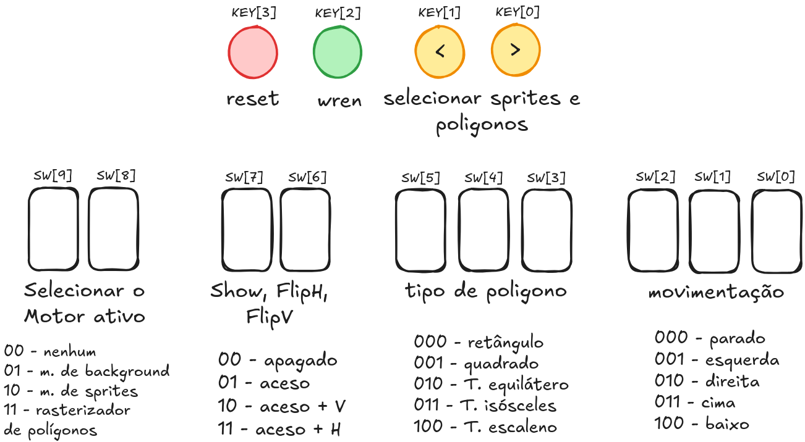

<h2 align="center">DESENVOLVIMENTO INCIAL DE UM COPROCESSADOR GRÁFICO</h2>

<details>
<summary><h2>Sobre o projeto</h2></summary>

Este repositório contém a implementação em Verilog do núcleo de um coprocessador gráfico de 16 bits, projetado para a placa de desenvolvimento Terasic DE1-SoC (Intel Cyclone V SoC). 
O projeto realiza a renderização de cenários baseados em tiles (background), sprites independentes e polígonos em tempo real, preparando a base de hardware para a 
integração futura com o processador ARM sob o sistema operacional Linux.


<details>
<summary> <b>CONTRIBUIDORAS</b> </summary>
  
<div align="center">
  <a href="https://github.com/AnaluzLima"></a>
  <a href="https://github.com/matoslarissa5025-droid"></a>
  <a href="https://github.com/vivi2604"></a>
</div>

</details>

<details>
<summary> <b>REQUISITOS</b> </summary>

O desenvolvimento do coprocessador gráfico deve cumprir:
- **Entrada e saída:**
  - A saída de vídeo deverá operar em 640 × 480 pixels, aproximadamente 60 Hz, por meio da interface VGA da DE1-SoC; ✅
  - A resolução lógica da cena deverá ser de 320 × 240 pixels, com duplicação de pixels na saída; ✅
  - Os botões, chaves e LEDs da placa usados exclusivamente para a demonstração do núcleo; ✅
    
- **Núcleo do coprocessador gráfico — Verilog:**
  - Todo o núcleo deverá ser descrito em Verilog; ✅
  - A arquitetura deverá ser modular; ✅
  - Todos os registradores e memórias deverão possuir estratégia definida de reinicialização ou inicialização; ✅
  - A saída não poderá apresentar instabilidade visual, perda de sincronismo ou pixels indefinidos após a inicialização; ✅
    
- **Motor de background:**
  - Implementar ao menos uma camada de background baseada em tilemap de 40 × 30 entradas; ✅
  - Utilizar tiles de 8 × 8 pixels armazenados em memória interna, com pelo menos 256 padrões disponíveis; ✅
  - Permitir deslocamento horizontal e vertical da camada, com tratamento de repetição ou recorte definido pela equipe; ✅
  - Gerar um índice de cor válido para cada pixel da região visível sem interromper o fluxo de vídeo; ✅
    
- **Motor de sprites:**
  - Disponibilizar memória de atributos para, no mínimo, 32 sprites; ✅
  - Suportar sprites de 16 × 16 pixels, podendo utilizar quatro tiles de 8 × 8 pixels para formar cada imagem; ✅
  - Cada sprite deverá possuir, no mínimo, posição X e Y, índice do padrão gráfico, habilitação, prioridade, espelhamento horizontal, espelhamento vertical e seleção de paleta; ✅
    
- **Rasterizador de polígonos:**
  - Implementar o desenho de triângulos e retângulos preenchidos; ✅
  - Utilizar aritmética inteira; ✅
  
- **Compositor, paleta e saída VGA:**
  - Combinar, a cada pixel, as contribuições do background, da camada de polígonos e dos sprites; ✅
  - Implementar pelo menos três níveis de prioridade entre as camadas; ✅
  - Aplicar transparência antes da seleção do pixel final; ✅
  - Converter o índice de 8 bits por meio de uma paleta programável de 256 entradas RGB; ✅

</details>
</details>

---

<details>
<summary><h2>Arquitetura do Sistema</h2></summary>

A arquitetura final do coprocessador gráfico é estruturada em blocos funcionais modulares que dividem de forma clara o domínio do desenho e o domínio da exibição física do vídeo.

O núcleo do sistema opera através de um Varredor Lógico Interno a uma frequência de 25 MHz, que percorre as coordenadas <code>X</code> e <code>Y</code> da tela de 320x240 pixels de forma 
assíncrona ao sincronismo VGA. Durante essa varredura interna rápida, que leva apenas 3,07 ms para processar a tela inteira, os três motores gráficos calculam seus dados simultaneamente 
para a coordenada atual:

- O Motor de Background aplica os parâmetros de deslocamento de rolagem e busca o índice de tile correspondente na memória RAM do Tilemap de 40x30.
  - Recebe as coordenadas já na resolução de 320x240;
  - Calcula o deslocamento vertical e horizontal;
  - Divide a tela em um tilemap de 40x30;
  - Calcula o endereço de qual tile o VGA está analisando no momento;
  - Manda o endereço para a RAM e devolve a cor do tile;
  
- O Motor de Sprites varre seu banco de dados para determinar se algum dos 32 sprites ativos intersecta a coordenada atual, calculando o espelhamento e o deslocamento horizontal ou vertical
  e acessando a cor do sprite na memória ROM.
  - Pega as informações no banco de registradores de todos os 32 sprites e divide em diferentes barramentos;
  - Verifica se o sprite está ativo no pixel atual;
  - Analisa a ordem de prioridade dos sprites;
  - Calcula o espelhamento vertical e horizontal de cada sprite;
  - Calcula o endereço do sprite e acessa na memória para saber a cor do pixel;
  - Manda o desenho do sprite;
    
- O Rasterizador de Polígonos executa em paralelo o teste de aresta por produto vetorial para os 8 polígonos em registradores.
  - Transforma as entradas do VGA em números com sinal;
  - Pega as informações no banco de registradores de todos os 8 polígonos e divide em diferentes barramentos;
  - Verifica se o polígono está ativo no pixel atual;
    - Dependendo do polígono há o cálculo da função de aresta;
  - Analisa a ordem de prioridade dos polígonos;
  - Manda o desenho do polígono;

O “Compositor de Camadas” (que na verdade, por conta dos próprios motores já desenharem sua saída, se tornou apenas uma linha de código que junta as 3 saídas para desenho no VGA) recebe as 
saídas dos motores de forma combinacional para a coordenada e avalia instantaneamente a transparência e as prioridades. Com latência de 1 ciclo de clock para estabilização de leitura das 
Block RAMs, o byte de cor resultante de 8 bits é escrito diretamente no Back Buffer.

A alternância cíclica de leitura e escrita ocorre exatamente no período de descida do sinal de sincronismo vertical do VGA (VGA_VS), que define o intervalo de apagamento. O buffer que acabou 
de ser preenchido pelos motores (Back Buffer) assume o papel de Front Buffer de exibição, enquanto o buffer antigo passa a ser o novo alvo de desenho.

O Controlador VGA realiza a leitura sequencial, dedicada e estável de pixels exclusivamente sobre o Front Buffer, enviando o índice de cor de 8 bits para a Paleta de Cores Programável 
(CLUT) presente no Driver VGA criado por [V. Hunter Adams](https://vanhunteradams.com/DE1/VGA_Driver/Driver.html), que por sua vez gera as intensidades RGB de 8 bits para exibição limpa no 
monitor físico.

Além desses módulos, alguns outros foram desenvolvidos. São eles:

| Módulo | Função |
| :---: | :---: |
| RegSprites | Armazena todos os atributos dos sprites |
| RegPoligonos | Armazena todas as informações para desenhar o polígono; |
| divisor_frequencia | Usado para dividir o clock da placa para 25 MHz e para deixar a movimentação mais lenta e visível a olho humano; |
| GerenciadorControle | Módulo com uma MEF interna apenas para testes diretamente na placa; |


</details>

---

<details>
<summary><h2>Justificativa das Decisões de Projeto</h2></summary>

1. **Imunidade a Inconsistências Visuais**: A técnica de Double Buffering com troca de ponteiros no sincronismo vertical garante que o monitor VGA nunca leia uma tela sendo desenhada pela
   metade pelos motores, provendo estabilidade visual.

2. **Folga de Desempenho**: Ao desenhar um quadro inteiro em apenas 3,07 ms utilizando o clock de 25 MHz, o hardware consome menos de 20% do orçamento de tempo de varredura
   física do monitor (16,6 ms), assegurando alto desempenho e margem para fechamento de timing no Quartus.

3. **Aritmética Inteira signed no Rasterizador**: Parametrizar as coordenadas e os cálculos dos multiplicadores DSP como números inteiros com sinal resolve erros de
   estouro aritmético quando vértices de polígonos móveis ou estáticos se localizam parcialmente fora do campo visível (coordenadas negativas), eliminando distorções na tela.

4. **Paralelismo de Alta Densidade**: O uso simultâneo de 43 blocos multiplicadores DSP dedicados garante que a validação lógica dos 8 polígonos ocorra em tempo real a cada pixel do
   varredor, sem atrasos de processamento.

5. **Reformulação do Compositor**: O problema tem como um dos requisitos o desenvolvimento de motores gráficos e compositor, entretanto, sabendo que as suas funcionalidades
    se assemelham, o compositor foi convertido em um seletor, sendo responsável apenas pela cor final do pixel, enquanto os motores são responsáveis pelos cálculos.

</details>

---

<details>
<summary><h2>Testes e Validação</h2></summary>

A validação de funcionamento e a conformidade do hardware foram realizadas de forma prática e em tempo real diretamente na placa de desenvolvimento DE1-SoC conectada a um monitor de vídeo, 
sob acompanhamento do professor e tutor da disciplina.

Para a demonstração prática, a interface do coprocessador foi adaptada temporariamente para receber comandos por meio das chaves deslizantes <code>(SW[9:0])</code> e dos botões do 
tipo push-button <code>(KEY[3:0])</code> da placa, permitindo injetar e testar as seguintes funcionalidades obrigatórias exigidas pelo problema:

- **Transparência**: Verificação de que o índice de cor lógico 0 gerado pelas camadas de sprites e polígonos é devidamente processado como transparente,
  revelando a imagem do background por trás sem a presença de caixas de delimitação, assim como apresentado na Figura 1.

<div align="center">
  <figure>
    
    <figcaption>
      Figura 1 - Sprite com Pixels Transparentes se Movimentando Pela Tela
    </figcaption>
  </figure>
</div>

<br></br>

- **Espelhamento**: Demonstração da aplicação em tempo real dos sinais de inversão de eixos para os sprites (Figura 2), comprovando que a leitura reversa das ROMs em hardware de fato inverte as
  imagens horizontais e verticais na tela de exibição.

<div align="center">
  <figure>
    
    <figcaption>
      Figura 2 - Espelhamento Vertical e Horizontal do Sprite
    </figcaption>
  </figure>
</div>

<br></br>

- **Sobreposição e Prioridade**: Teste físico de sobreposição de elementos na tela. Foi verificado que, sob as mesmas coordenadas <code>X</code> e <code>Y</code>, as prioridades entre as camadas
  de background, polígonos e os sprites de 16x16 são respeitadas, com os sprites passando na frente ou por trás de outros blocos conforme configurado, assim como pode ser visualizado nas Figuras 3 e 4.

<div align="center">
  <figure>
    
    <figcaption>
      Figura 3 - Teste da Ordem de Prioridade dos Sprites
    </figcaption>
  </figure>
</div>

<br></br>

<div align="center">
  <figure>
    
    <figcaption>
      Figura 4 - Teste da Prioridade Entre Motores
    </figcaption>
  </figure>
</div>

<br></br>

- **Troca de Buffers**: Demonstração da renderização de imagens complexas sem rasgos de tela ou oscilações de pixels, validando fisicamente que a transição de visualização entre o Back Buffer
  de desenho e o Front Buffer de exibição é acionada unicamente no sincronismo de descida do sinal vertical do VGA.

</details>

---

<details>
<summary><h2>Recursos Utilizados</h2></summary>

O desenvolvimento e os testes físicos foram realizados na placa DE1-SoC (FPGA Cyclone V 5CSEMA5F31C6), apresentando a seguinte utilização de recursos 
após a síntese unificada no Quartus Prime:

| Recurso de Hardware | Utilização | Disponível | % de Uso | Justificativa |
| :--- | :---: | :---: | :---: | :--- |
| ALMs (Logic Utilization) | 3.507 | 32.070 | 11% | Lógica combinacional e sequencial dos motores, controle e compositor. |
| Registradores | 2.033 | - | - | Bancos de registradores de sprites, polígonos, divisores de clock e controle de estado. |
| Block Memory Bits (BRAM) | 1.303.936 | 4.065.280 | 32% | Alocação de dois Framebuffers de 320x240 (2 * 614.400 bits), Tilemap de 40x30 (9.600 bits) e ROM de Sprites (65.536 bits). |
| DSP Blocks | 43 | 87 | 49% | Multiplicadores de hardware dedicados para o cálculo paralelo das equações de aresta de 8 triângulos. |
| Pinos de I/O | 241 | 457 | 53% | Conexões físicas com o DAC de vídeo VGA, chaves, botões e LEDs indicadores. |

### Timming
- **Domínios de Clock**: O circuito opera com o clock base de 25 MHz para a geração do sinal VGA, varredura lógica interna dos motores e controle síncrono das memórias M10K de duas portas.
  As bases temporais lentas ( =~ 23,8 Hz e =~ 1,49 Hz) controlam a velocidade de varredura dos botões, seleção e movimentação para evitar saltos bruscos na tela.
- **Latência de Escrita**: O registrador retém o endereço de gravação por exatos 1 ciclo de clock. Esse atraso compensa a latência de leitura e processamento dos motores
  (MotorBG, MotorSprites e rasterizadorPoligonos), garantindo que o byte de cor resultante seja gravado na mesma célula de memória do Back Buffer.
- **Latência de Leitura**: O driver VGA lê a memória pronta no Front Buffer por meio da porta dedicada de leitura, sem concorrer com a porta de gravação dos motores.

</details>

---

<details>
<summary><h2>Gargalos e Limitações</h2></summary>

- **Comportamento de Borda nos Polígonos**: O polígono possui limitação de colisão com as bordas da tela lógica de 320x240. Porém, caso o polígono seja encostado na borda e o seu tipo seja
- alterado nas chaves, ele pode ultrapassar o limite da tela. Se o usuário movimentá-lo para dentro da tela e tentar tirá-lo novamente, o limitador volta a atuar e impede a saída.
- **Capacidade Fixa de Instâncias**: O hardware comporta a exibição simultânea de no máximo 8 polígonos e 32 sprites em paralelo.
- **Cenário Estático**: Ainda não foi implementado um background dinâmico ou diferentes opções de mapas além do tilemap padrão de 40x30 carregado no arquivo mif.
- **Sprites Fixos na ROM**: Os padrões visuais dos sprites são estáticos, ficando gravados diretamente na memória ROM interna sem possibilidade de substituição por software em tempo de execução.
- **Consumo de Blocos DSP**: A resolução das inequações de semiplano dos 8 triângulos concorre diretamente por 43 blocos multiplicadores de hardware, atingindo 49% da capacidade total da Cyclone V.

</details>

---

<details>
<summary><h2>Melhorias Futuras</h2></summary>

- **Definição Dinâmica de Sprites**: Substituir a memória ROM de sprites por uma memória RAM gravável pela interface de controle, permitindo carregar sprites personalizadas via software
  para eliminar a dependência do coprocessador em relação a um único jogo específico.
- **Alteração Dinâmica do Background**: Permitir a troca dinâmica entre múltiplos mapas de cenário em tempo real.
- **Correção na Transição dos Polígonos**: Implementar um reajuste automático nas coordenadas para que a nova forma respeite os limites das bordas mesmo se o tipo for alterado
  enquanto ela estiver encostada no canto da tela.
- **Pipeline de Polígonos**: Compartilhamento temporal das unidades aritméticas de multiplicação (reuso de multiplicadores de hardware) para otimizar e reduzir o número de blocos
  DSP consumidos, permitindo desenhar mais formas geométricas de forma compacta.

</details>

---

<details>
<summary><h2>Guia de Uso</h2></summary>

- Abra o Projeto no Quartus;
- Defina o arquivo <code>DE1_SOC_golden_top.v</code> como top-level;
- Aperte <code>Start Compilation</code>;
- Após compilar, clique em <code>Tools</code> → <code>Programmer</code>, configure a placa e clique em <code>Start</code>;
- A Figura 5 apresenta o significado de cada botão/switch da placa e sua codificação;

<div align="center">
  <figure>
    
    <figcaption>
      Figura 5 - Funcionamento dos pinos de Input da DE1-SoC
    </figcaption>
  </figure>
</div>

</details>

---

<details>
<summary><h2>Tecnologias Utilizadas</h2></summary>
  
  - Quartus Prime Version 25.1std.0 Build 1129 10/21/2025 SC Lite Edition
  - [Excalidraw](https://excalidraw.com/)
  - <details> <summary> <b>Python 3.12.3</b> </summary>
    Foram usados dois scripts em python gerados pela Inteligência Artificial Gemini para a conversão de imagens em formato <code>.mif</code>. 

    ### Script para a Conversão dos 32 Sprites em um Arquivo <code>.mif</code>
    ```
    import os
    from PIL import Image
    
    def png_to_rgb332(r, g, b, a):
        # Canal Alpha: Se o pixel for transparente, retorna 0x00
        if a < 128:
            return 0x00
        
        # Converte RGB (8 bits cada) para o formato indexado RGB332 (1 byte)
        r3 = (r >> 5) & 0x07
        g3 = (g >> 5) & 0x07
        b2 = (b >> 6) & 0x03
        
        val = (r3 << 5) | (g3 << 2) | b2
        # Evita que uma cor opaca muito escura gere acidentalmente a cor de transparência (0x00)
        return 0x01 if val == 0x00 else val
    
    def gerar_mif():
        NUM_SPRITES = 32
        SPRITE_SIZE = 16
        TOTAL_WORDS = NUM_SPRITES * SPRITE_SIZE * SPRITE_SIZE  # 8192 palavras de 8 bits
        
        with open("sprites.mif", "w") as f:
            f.write("WIDTH=8;\n")
            f.write(f"DEPTH={TOTAL_WORDS};\n\n")
            f.write("ADDRESS_RADIX=HEX;\n")
            f.write("DATA_RADIX=HEX;\n\n")
            f.write("CONTENT BEGIN\n")
            
            addr = 0
            for sprite_id in range(NUM_SPRITES):
                # Busca diretamente os arquivos na mesma pasta
                caminho_img = f"sprite{sprite_id}.png"
                
                if os.path.exists(caminho_img):
                    img = Image.open(caminho_img).convert("RGBA").resize((SPRITE_SIZE, SPRITE_SIZE))
                    for y in range(SPRITE_SIZE):
                        for x in range(SPRITE_SIZE):
                            r, g, b, a = img.getpixel((x, y))
                            cor_byte = png_to_rgb332(r, g, b, a)
                            f.write(f"    {addr:04X} : {cor_byte:02X};\n")
                            addr += 1
                    print(f"[OK] {caminho_img} processado com sucesso!")
                else:
                    print(f"[AVISO] {caminho_img} nao encontrado. Preenchendo com zeros (transparente).")
                    for _ in range(256):
                        f.write(f"    {addr:04X} : 00;\n")
                        addr += 1
                        
            f.write("END;\n")
        print("\nArquivo 'sprites.mif' gerado com sucesso!")
    
    if __name__ == "__main__":
        gerar_mif()
    ```

    ### Script para a Conversão de uma Imagem em 40x30 Tiles no Formato <code>.mif</code>

    ```
    import sys
    from PIL import Image
    
    def converter_rgb_para_rgb332(r, g, b):
        """
        Converte uma cor RGB de 24 bits (8-8-8) para RGB332 (8 bits):
        - R: 3 bits mais significativos (0 a 7)
        - G: 3 bits mais significativos (0 a 7)
        - B: 2 bits mais significativos (0 a 3)
        """
        r_3bit = (r >> 5) & 0x07
        g_3bit = (g >> 5) & 0x07
        b_2bit = (b >> 6) & 0x03
    
        # Empacota em [7:5]=R, [4:2]=G, [1:0]=B
        rgb332 = (r_3bit << 5) | (g_3bit << 2) | b_2bit
        return rgb332
    
    def png_para_tilemap_mif(caminho_imagem, caminho_mif="tilemap.mif"):
        # Carrega a imagem e converte para RGB
        img = Image.open(caminho_imagem).convert("RGB")
        
        # Redimensiona para 40x30 caso a imagem original tenha outra resolução
        if img.size != (40, 30):
            print(f"Aviso: Redimensionando imagem de {img.size} para (40, 30)...")
            img = img.resize((40, 30), Image.Resampling.NEAREST)
    
        largura, altura = img.size
        total_palavras = largura * altura  # 40 * 30 = 1200 endereços
    
        with open(caminho_mif, "w") as f:
            # Cabeçalho padrão do Quartus MIF
            f.write("WIDTH=8;\n")
            f.write(f"DEPTH={total_palavras};\n\n")
            f.write("ADDRESS_RADIX=HEX;\n")
            f.write("DATA_RADIX=HEX;\n\n")
            f.write("CONTENT BEGIN\n")
    
            # Varre linha por linha (Y de 0 a 29) e coluna por coluna (X de 0 a 39)
            for y in range(altura):
                for x in range(largura):
                    endereco = (y * largura) + x
                    r, g, b = img.getpixel((x, y))
                    cor_8bit = converter_rgb_para_rgb332(r, g, b)
                    
                    f.write(f"    {endereco:04X} : {cor_8bit:02X};\n")
    
            f.write("END;\n")
    
        print(f"Sucesso! Arquivo '{caminho_mif}' gerado com {total_palavras} posicoes.")
    
    if __name__ == "__main__":
        # Nome do arquivo de imagem de entrada
        arquivo_entrada = "mapa.png" if len(sys.argv) < 2 else sys.argv[1]
        png_para_tilemap_mif(arquivo_entrada)
    ```
  
  </details>

</details>

---

<details>
<summary><h2>Considerações Finais</h2></summary>

Este trabalho corresponde apenas à primeira fase do projeto de desenvolvimento do coprocessador gráfico, sendo notável o bom funcionamento da arquitetura criada e as possíveis melhorias
para as fases posteriores. Nelas, haverá a construção da Instruction Set Architecture (ISA) e, por último, a implementação do jogo em linguagem C. 

</details>
